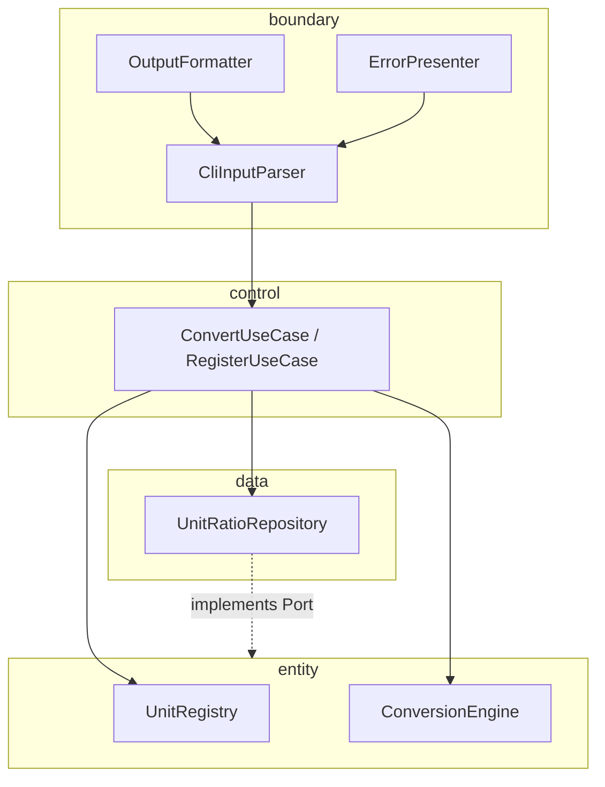

# Unit Converter (Python)

**meter 기준 길이 단위 변환 CLI**를 계약·pytest·BCE 레이어로 검증하며, **Python·TDD·클린 아키텍처 학습자**가 OCP/SRP와 테스트 선행 리팩터링을 체득하기 위한 실습 프로젝트입니다.


---

## 목차

- [개요 (Overview)](#개요-overview)
- [진행 상황 (Progress)](#진행-상황-progress)
- [빠른 시작 (Quick Start)](#빠른-시작-quick-start)
- [지원 단위 및 비율](#지원-단위-및-비율)
- [입력 형식 계약](#입력-형식-계약)
- [아키텍처](#아키텍처)
- [테스트 실행](#테스트-실행)
- [RED 단계 To-Do 리스트](#red-단계-to-do-리스트)
- [Golden Master 회귀 안전장치](#golden-master-회귀-안전장치)
- [GREEN 단계 To-Do 리스트](#green-단계-to-do-리스트)
- [설정 파일 (JSON/YAML)](#설정-파일-jsonyaml)
- [출력 포맷](#출력-포맷)
- [기여 가이드 (Contributing)](#기여-가이드-contributing)
- [라이선스](#라이선스)
- [관련 문서](#관련-문서)

---

## 개요 (Overview)

### 이 프로젝트가 해결하는 문제

- `단위:값` 한 줄 입력으로 등록된 길이 단위를 **상호 변환**해 출력한다.
- 레거시 스크립트는 비율이 코드 분기에 박혀 있어 **단위 추가·회귀 검증**이 어렵다.
- 본 프로젝트는 “곱셈 공식”보다 **계약(입력·stderr·출력)·불변식·테스트**를 먼저 고정하고, AI 보조 구현 환경에서도 행위가 흔들리지 않게 한다.

### 주요 학습 목표

| 목표 | 내용 |
|------|------|
| **OCP** | 신규 단위는 Registry·설정으로 추가; 환산 엔진 공개 API는 유지 |
| **SRP** | 환산(entity)·유스케이스(control)·파싱·포맷(boundary)·설정(data) 분리 |
| **BCE** | boundary → control → entity 의존; entity는 I/O·포맷 무의존 |
| **TDD** | RED(실패 테스트) → GREEN(최소 구현) → REFACTOR(green 유지) |

### PRD와의 연결

요구·인수·회귀 규칙의 **단일 기준(Source of Truth)** 은 [doc/PRD.md](doc/PRD.md)이며, 작업 진행은 [doc/TODO.md](doc/TODO.md)를 따릅니다.

> **구현 상태:** TDD **GREEN (02) 완료** — BCE 레이어(`entity`/`control`/`boundary`/`data`) 구현, `tests/red/` 14/14 PASS, 전체 `tests/` 69 PASS. 진입점: `boundary.app` · `main/UnitConverter.py`(위임). 상세는 [진행 상황](#진행-상황-progress).

---

## 진행 상황 (Progress)

**최종 갱신:** 2026-05-21 · **현재 단계:** TDD GREEN (02) · **브랜치:** `green` (base: `B_10`)

### TDD 사이클

| 단계 | 상태 | 비고 |
|------|------|------|
| **RED** | ✅ 완료 | `tests/red/` 14건 스켈레톤 → 의도적 FAIL |
| **GREEN** | ✅ 완료 | Dual-Track TC-A/B 14/14 PASS · 전체 69 PASS |
| **REFACTOR** | 🔲 예정 | pytest green 유지하며 구조 정리 |

### 완료 항목 (RED)

| 구분 | 산출물 | 설명 |
|------|--------|------|
| 문서 | `doc/PRD.md`, `doc/TODO.md`, `doc/RED_phase_tests.md`, `doc/defect_list.md` | 계약·RED 명세·결함 |
| RED 게이트 | `tests/red/test_boundary_red.py`, `tests/red/test_entity_red.py` | TC-A-01~07, TC-B-01~07 |
| 기록 | [prompt/01.red.md](prompt/01.red.md), [report/01.red.md](report/01.red.md) | RED 로그·보고서 |

### 완료 항목 (GREEN)

| 구분 | 산출물 | 설명 |
|------|--------|------|
| Domain | `entity/` — `UnitRegistry`, `ConversionEngine`, `DomainError` | meter 허브 환산, `register_from_ref` |
| Control | `control/` — `ConvertUseCase`, `RegisterUseCase` | entity 오케스트레이션 |
| Boundary | `boundary/` — `CliInputParser`, `OutputFormatter`, `ErrorPresenter`, `UnitConverterApp` | 파싱·표현·stderr |
| Data | `data/config_loader.py`, `config/units.json` | JSON/YAML·기본값 fallback |
| 회귀 테스트 | `tests/entity/`, `tests/boundary/`, `tests/data/` | 36+건 PASS |
| 기록 | [prompt/02.green.md](prompt/02.green.md), [report/02.green.md](report/02.green.md), [task/green/02.green.md](task/green/02.green.md) | GREEN 로그·보고·실행 프롬프트 |
| 레거시 | `main/UnitConverter.py` | 인라인 환산 제거 → `UnitConverterApp` 위임 |

### pytest 현황 (GREEN 검증)

```bash
py -3 -m pytest tests/red/ -v    # 14 passed
py -3 -m pytest tests/ -v        # 69 passed, 0 failed
```

| 스위트 | collected | 결과 |
|--------|-----------|------|
| `tests/red/` (TC-A/B 게이트) | 14 | **14 passed** |
| `tests/entity/` | 20 | passed |
| `tests/boundary/` | 20 | passed |
| `tests/data/` | 5 | passed |
| `tests/test_golden_master.py` (GM) | 4 | **4 passed** |
| **합계** | **73** | **73 passed** |

### 커버리지 (2026-05-21)

```bash
py -3 -m pytest tests/ --cov=entity --cov=boundary --cov=control --cov-report=term-missing
```

| 레이어 | 목표 | 실측 |
|--------|------|------|
| Domain (`entity` + `control`) | ≥ 95% | **96.3%** |
| Boundary | ≥ 85% | **85.1%** |

### TODO 연동 (doc/TODO.md)

| ID | RED | GREEN |
|----|-----|-------|
| M-01~M-02, M-09 | ✅ `tests/red/` + entity | ✅ |
| M-04~M-07 | ✅ boundary RED | ✅ |
| M-14 (config) | — | ✅ `tests/data/`, TC-B-06~07 |

**다음 작업:** `refactor` 브랜치 — 구조 정리·중복 제거 (pytest green 유지). 체크리스트: [GREEN 단계 To-Do](#green-단계-to-do-리스트).

---

## 빠른 시작 (Quick Start)

### 사전 조건

| 항목 | 요구 |
|------|------|
| Python | **3.11+** |
| 패키지 관리 | `venv` 권장 |
| 테스트 (목표) | `pytest`, `pytest-cov` |
| 검증 (목표) | `pydantic` |

### 가상환경 · 실행

```bash
# 가상환경 생성
python -m venv venv

# 활성화 (Windows)
venv\Scripts\activate

# 활성화 (macOS/Linux)
source venv/bin/activate

# 의존성 (개발)
pip install -r requirements-dev.txt

# 실행 (BCE — 권장)
python -m boundary.app
# 또는 레거시 래퍼 (내부적으로 UnitConverterApp 위임)
python main/UnitConverter.py
```

프롬프트에 `Insert value for converting (ex: meter:2.5):` 가 나오면 입력합니다.

### 예시 입출력 (목표 계약 · table)

**입력**

```text
meter:5.0
```

**stdout (목표 · PRD §6.1, 표시 1자리 half-up)**

```text
5.0 meter = 16.4 feet
5.0 meter = 5.5 yard
5.0 meter = 5.0 meter
```

| 항목 | 값 |
|------|-----|
| Domain raw (검증용) | feet ≈ 16.4042, yard ≈ 5.46805 |
| 줄 수 | 등록 단위 수 (기본 3) |
| exit code | `0` |

**표현 계약:** 모든 줄의 왼쪽 `{amount} {unit}` 은 **사용자 입력과 동일**합니다.

### 진입점

| 경로 | 설명 |
|------|------|
| `python -m boundary.app` | BCE 앱 (`UnitConverterApp.run_line`) |
| `python main/UnitConverter.py` | 레거시 경로 — 동일 App 위임 |

---

## 지원 단위 및 비율

**기준 단위(hub):** `meter` — 모든 환산은 `meters_per_unit` 으로만 유도합니다.  
**feet ↔ yard 직접 비율 상수 사용 금지.**

| 표시명 | 식별자 (`unit_id`) | meters_per_unit (1 unit = X meter) | 출처 |
|--------|-------------------|-------------------------------------|------|
| meter | `meter` | `1.0` | PRD §5.1 · 기준 |
| feet | `feet` | `3.28084` | README · `1 m = 3.28084 ft` |
| yard | `yard` | `1.09361` | README · `1 m = 1.09361 yd` |

**동적 등록(권장):** 런타임에 `register:cubit=0.4572:meter` 등으로 추가.  
**부동소수 동등(EPS):** `|a−b| ≤ max(1e-9, 1e-9 × max(|a|,|b|))`

---

## 입력 형식 계약

### 명령 종류

| 명령 | 패턴 | 우선순위 |
|------|------|----------|
| CONVERT | `{unit_id}:{amount}` | 필수 |
| REGISTER | `register:{new}={ratio}:{ref_unit}` | 권장 |
| SET_FORMAT | `format:table` \| `format:json` \| `format:csv` | 권장 |

- `unit_id`: `[a-z][a-z0-9_]{0,31}`
- `amount`: 유한 실수, **`>= 0`** (정책 **NEG-01**)
- 입력 한 줄 최대 **256자**

### 정상 예시 3개

| 입력 | 의미 |
|------|------|
| `meter:2.5` | 2.5 meter를 모든 등록 단위로 변환 |
| `feet:3.28084` | 3.28084 feet → meter ≈ 1.0 (표현 계약: LHS `3.28084 feet`) |
| `register:cubit=0.4572:meter` | 1 cubit = 0.4572 meter 등록 (권장) |

### 비정상 예시 3개 + 에러

| 입력 | `code` | exit | stderr message 패턴 |
|------|--------|------|---------------------|
| `meter` (콜론 없음) | `MALFORMED_INPUT` | 1 | `Invalid format. Use unit:value (ex: meter:2.5)` |
| `meter:2.5.3` | `NON_NUMERIC` | 1 | `Invalid number: 2.5.3` |
| `meter:-1` | `NEGATIVE_VALUE` | 1 | `Value must be non-negative: -1` |

**실패 공통:** stdout에 `{source} = {target}` 형태 변환 줄 **0줄**.

### 기타 error code (참고)

| 조건 | `code` | exit |
|------|--------|------|
| 미등록 단위 `cubit:1` | `UNKNOWN_UNIT` | 1 |
| 257자 이상 | `INPUT_TOO_LONG` | 1 |
| `Meter` (대문자) | `INVALID_UNIT_ID` | 1 |
| NaN / Inf | `NON_FINITE_VALUE` | 1 |
| 설정 파일 오류 (기동) | `CONFIG_LOAD_FAILED` / `SCHEMA_INVALID` | 2 |
| `format:xml` | `UNSUPPORTED_FORMAT` | 1 |

상세: [doc/PRD.md §3.2](doc/PRD.md)

---

## 아키텍처

### BCE 레이어 (목표 구조)



### 의존성 방향

| 허용 | 금지 |
|------|------|
| boundary → control | entity → boundary |
| control → entity | entity → data 구현체 |
| control → data (Port) | control → boundary |

### 새 단위 추가 (코드 최소화)

1. **설정:** `config/units.json` 의 `units[]` 에 `{ "id": "...", "meters_per_unit": ... }` 추가  
2. **또는 런타임:** `register:new_unit=ratio:ref_unit` 입력  
3. **검증:** `pytest tests/entity/` — 기존 환산 TC는 수정 없이 pass  
4. **금지:** `ConversionEngine` 에 `if unit == "new":` 분기 추가  

환산식 (단일 경로):

```text
target_amount = source_amount × MetersPerUnit(source) ÷ MetersPerUnit(target)
```

### 디렉터리

**현재 (2026-05-21 · GREEN 완료)**

```text
entity/          # UnitRegistry, ConversionEngine
control/         # ConvertUseCase, RegisterUseCase
boundary/        # CliInputParser, OutputFormatter, ErrorPresenter, app
data/            # config_loader, models
config/          # units.json
tests/
  red/           # TC-A-01~07, TC-B-01~07 (GREEN 게이트 14/14)
  entity/        # Domain 회귀
  boundary/      # Boundary 회귀
  data/          # 설정 로드
main/            # UnitConverter.py → App 위임
doc/             # PRD, test_plan, defect_list, RED_phase_tests
prompt/          # 01.red.md, 02.green.md
report/          # 01.red.md, 02.green.md, 00.red_test_compare.md
task/green/      # 02.green.md (실행 프롬프트)
pytest.ini
```

---

## 테스트 실행

### 프레임워크

- **pytest** + **pytest-cov**

### 명령

```bash
# 전체 테스트 (GREEN: 69 passed)
py -3 -m pytest tests/ -v

# RED/GREEN 게이트만 (14 passed)
py -3 -m pytest tests/red/ -v

# 레이어별
py -3 -m pytest tests/entity/ -v
py -3 -m pytest tests/boundary/ -v
py -3 -m pytest tests/data/ -v

# Golden Master 회귀 (4 passed)
py -3 -m pytest -m golden_master -v

# 커버리지 (PRD §4.3)
py -3 -m pytest tests/ \
  --cov=entity --cov=control --cov=boundary --cov=data \
  --cov-report=term-missing --cov-report=html
```

### 커버리지 목표

| 레이어 | Line % | Branch % |
|--------|--------|----------|
| entity | ≥ 95 | ≥ 90 |
| control | ≥ 90 | ≥ 85 |
| boundary | ≥ 85 | ≥ 80 |
| data | ≥ 90 | ≥ 85 |
| **overall** | ≥ 85 | — |

### 인수 · BDD

- **Gherkin:** 8 scenarios (PRD 부록 B) — happy path, 형식 오류, NON_NUMERIC, 음수, unknown unit, 표현 계약, zero, meter 경유  
- **체크리스트:** [doc/TODO.md](doc/TODO.md) §회귀 방지

---

## RED 단계 To-Do 리스트

> 이 체크리스트는 test_plan.md 기반으로 생성되었습니다.
> 각 항목은 RED(실패 테스트 작성) 완료 시 체크합니다.

### Track A — UI / Boundary 테스트
- [x] TC-A-01: 정상 입력 "meter:2.5" → 변환 결과 반환 (Happy Path)
- [x] TC-A-02: ":" 없는 입력 → ValueError / TypeError 발생
- [x] TC-A-03: 음수 입력 "meter:-1.0" → ValueError / TypeError 발생
- [x] TC-A-04: 없는 단위 "parsec:1.0" → ValueError / TypeError 발생
- [x] TC-A-05: 소수점 파싱 실패 "meter:abc" → ValueError / TypeError 발생
- [x] TC-A-06: 출력 포맷에 원 입력 단위·값 보존 ("2.5 meter = ...")
- [x] TC-A-07: value=0 경계값 처리 확인

### Track B — Domain / Logic 테스트
- [x] TC-B-01: convert("meter", 2.5, "feet") == 8.20210 (오차 1e-5)
- [x] TC-B-02: convert("meter", 1.0, "yard") == 1.09361 (오차 1e-5)
- [x] TC-B-03: convert("feet", 1.0, "meter") == 0.30480 (역변환)
- [x] TC-B-04: convertAll("meter", 1.0) → 모든 등록 단위 변환 반환
- [x] TC-B-05: registerUnit("cubit", 0.4572) 후 변환 가능
- [x] TC-B-06: loadConfig(유효한 경로) → 비율 정상 로드
- [x] TC-B-07: loadConfig(없는 경로) → 기본값(3.28084/1.09361) 유지

### 커버리지 목표 (RED 단계 계획)
- [x] Domain Logic: 95%+ (`entity`+`control` **96.3%**)
- [x] Boundary Layer: 85%+ (**85.1%**)
- [ ] 전체 TOTAL: 90%+ (실측 **89%** — 3패키지 합산, `data` 포함 시 상향 가능)

### 결함 목록 연결
- [x] [doc/defect_list.md](doc/defect_list.md) 생성 및 발견 결함 기록 (DEF-001~008)
- [x] 모든 결함 수정 후 회귀 테스트 통과 확인

---

## Golden Master 회귀 안전장치

> Refactoring 시작 전 구축. GREEN 완료 후 즉시 적용.

### 기준 파일 생성
- [x] GM-01: golden_master_expected.txt 생성 (meter:2.5 기준 출력)
- [x] GM-02: feet:1.0 / yard:1.0 / meter:0.0 시나리오 추가
- [x] GM-03: git add tests/golden_master_expected.txt (버전 관리 포함)

### 테스트 코드
- [x] GM-04: test_golden_master.py + golden_master_expected.txt 작성
- [x] GM-05: approve 패턴 적용 (파일 없으면 생성, 있으면 비교)
- [x] GM-06: pytest -m golden_master -v → PASS 확인

### CI 연동
- [x] GM-07: .github/workflows/golden_master.yml 작성
- [ ] GM-08: PR 머지 차단 (required status check) 설정 — GitHub **Settings → Branches → Branch protection** 에서 `Golden Master` 체크 필수
- [ ] GM-09: Refactoring 후 Golden Master 재실행 → PASS 확인

---

## GREEN 단계 To-Do 리스트

> 이 체크리스트는 [Dual_Track_list](Dual_Track_list) · [task/green/02.green.md](task/green/02.green.md) 기반입니다.  
> 각 항목은 **GREEN(테스트 통과·최소 구현)** 완료 시 체크합니다.  
> 게이트: `tests/red/` — `py -3 -m pytest tests/red/ -v` → **14 passed**

### Track B — Domain / Logic (우선)

| # | TC | 내용 | 커밋 | 상태 |
|---|-----|------|------|------|
| 1 | TC-B-01 | `convert("meter", 2.5, "feet")` ≈ 8.20210 | `feat(green): meter to feet` | [x] |
| 3 | TC-B-02 | `convert("meter", 1.0, "yard")` ≈ 1.09361 | `feat(green): meter to yard` | [x] |
| 5 | TC-B-03 | `convert("feet", 1.0, "meter")` 역변환 | `feat(green): feet to meter reverse` | [x] |
| 7 | TC-B-04~05 | `convert_all` + `register_from_ref(cubit)` | `feat(green): convertAll and registerUnit` | [x] |
| 9 | TC-B-06~07 | `load_units_config` 정상·missing fallback | `feat(green): loadConfig with fallback` | [x] |

### Track A — UI / Boundary

| # | TC | 내용 | 커밋 | 상태 |
|---|-----|------|------|------|
| 2 | TC-A-02 | `":"` 없음 → `ValueError`/`TypeError` | `feat(green): validate missing colon` | [x] |
| 4 | TC-A-03 | 음수 `meter:-1.0` → 예외 | `feat(green): validate negative value` | [x] |
| 6 | TC-A-04 | unknown `parsec:1.0` → 예외 | `feat(green): validate unknown unit` | [x] |
| 8 | TC-A-01,06,07 | happy path · LHS 보존 · `yard:0` | `feat(green): boundary happy path` | [x] |
| 10 | TC-A-05 | `meter:abc` → 예외 | `feat(green): validate non-numeric amount` | [x] |

### Track A — 상세 체크 (TC ID)

- [x] TC-A-01: `UnitConverterApp.run_line("meter:2.5")` → table 3줄, exit 0
- [x] TC-A-02: `parse("meter")` → `ValueError` / `TypeError`
- [x] TC-A-03: `parse("meter:-1.0")` → 예외
- [x] TC-A-04: `parse("parsec:1.0")` + registry → 예외
- [x] TC-A-05: `parse("meter:abc")` → 예외
- [x] TC-A-06: 모든 출력 줄 `2.5 meter = ` 접두
- [x] TC-A-07: `yard:0` → 전 target 0

### Track B — 상세 체크 (TC ID)

- [x] TC-B-01: `convert("meter", 2.5, "feet")` ≈ 8.20210 (tol 1e-5)
- [x] TC-B-02: `convert("meter", 1.0, "yard")` ≈ 1.09361
- [x] TC-B-03: `convert("feet", 1.0, "meter")` ≈ 0.30480
- [x] TC-B-04: `convert_all("meter", 1.0)` → 3 targets
- [x] TC-B-05: cubit 등록 후 `convert("cubit", 10, "meter")` ≈ 4.572
- [x] TC-B-06: 유효 JSON 경로 → 파일 비율 적용
- [x] TC-B-07: 없는 경로 → 기본 3.28084 / 1.09361

### 품질·구조 (GREEN 인수)

- [x] `tests/` 전체 **69 passed**, 0 failed
- [x] Domain Logic 커버리지 ≥ 95%
- [x] Boundary 커버리지 ≥ 85%
- [x] 비율 상수 `3.28084`/`1.09361` — `DEFAULT_METERS_PER_UNIT`·`config/units.json`만 (환산식 인라인 없음)
- [x] `main()` / `UnitConverterApp` — Domain 환산 로직 분리
- [ ] JSON/CSV 출력 포맷 (PRD §6.2·§6.3 — REFACTOR 또는 v1.1)
- [ ] Gherkin 8 scenarios 자동화 (선택)

### 기록

- [x] [report/02.green.md](report/02.green.md) — pytest·커버리지·TC 매핑
- [x] [prompt/02.green.md](prompt/02.green.md) — 프롬프트·답변 로그

**다음:** REFACTOR 브랜치 · [report/02.green.md](report/02.green.md) §9

---

## 설정 파일 (JSON/YAML)

### 위치 · 형식 (JSON 권장)

**경로:** `config/units.json`

```json
{
  "schema_version": 1,
  "base_unit": "meter",
  "units": [
    { "id": "meter", "meters_per_unit": 1.0 },
    { "id": "feet", "meters_per_unit": 3.28084 },
    { "id": "yard", "meters_per_unit": 1.09361 }
  ]
}
```

| 규칙 | 실패 시 |
|------|---------|
| `schema_version` must be `1` | `SCHEMA_INVALID` |
| `meter` 행 필수, 비율 > 0 | `SCHEMA_INVALID` |
| 파일 없음 / JSON 깨짐 | `FILE_NOT_FOUND` / `PARSE_ERROR` / `CONFIG_LOAD_FAILED` |

기동 실패 시 **exit 2**, 변환 수행 없음.

**YAML:** 선택(v2). 스키마 의미는 JSON와 동일.

### 동적 단위 등록 (런타임)

```text
register:cubit=0.4572:meter
```

| 항목 | 값 |
|------|-----|
| 의미 | 1 cubit = 0.4572 meter |
| 검증 예 | `cubit:10` → meter amount ≈ **4.572** (EPS 내) |
| 등록 전 | `cubit:1` → `UNKNOWN_UNIT` |

---

## 출력 포맷

기본: **table** (`format:table` 또는 미지정)

### 콘솔 (table) — PRD §6.1

```text
{source_amount} {source_unit} = {target_amount} {target_unit}
```

- **target:** 소수 1자리, half-up  
- **source:** 입력 amount·unit 그대로 (표현 계약)

### JSON — PRD §6.2 (권장)

```json
{
  "command": "CONVERT",
  "source": { "unit": "meter", "amount": 5.0 },
  "results": [
    { "unit": "feet", "amount": 16.4042 },
    { "unit": "yard", "amount": 5.4681 },
    { "unit": "meter", "amount": 5.0 }
  ]
}
```

- `results[].amount`: **4자리** half-up  
- `results` 길이 = 등록 단위 수

### CSV — PRD §6.3 (권장)

```csv
source_unit,source_amount,target_unit,target_amount
meter,5.0,feet,16.4042
meter,5.0,yard,5.4681
meter,5.0,meter,5.0
```

- 헤더 1행 + 데이터 행 수 = 등록 단위 수  
- `source_unit`, `source_amount` 는 모든 데이터 행에서 동일

### 포맷 정합

동일 CONVERT 입력에 대해 table · json · csv 의 **(target_unit → amount) 집합은 동일** (포맷별 반올림 자릿수만 다름).

---

## 기여 가이드 (Contributing)

### 계약 변경 금지

- [doc/PRD.md](doc/PRD.md) §3.2·§3.3·§6·§7.1 과 **모순되는** 입출력·비율·error code·stderr 패턴 변경은 **별도 RFC + 테스트 일괄 갱신** 없이 merge 하지 않습니다.
- 테스트를 통과시키기 위해 **assert·기대값·error code만 완화**하는 PR은 거부합니다 (PRD REG-05).

### 테스트 없는 PR

- 신규 동작·버그 수정 PR은 **대응 pytest**(또는 Gherkin) **필수**.
- Domain 변경은 `tests/entity/`; 파싱·포맷은 `tests/boundary/`; 설정은 `tests/data/`.

### RED → GREEN → REFACTOR

1. 실패하는 테스트 추가 (RED)  
2. 최소 구현으로 해당 테스트만 green  
3. 전체 관련 pytest green 유지하며 refactor  

### 커밋 메시지 컨벤션

```text
<type>: <scope> — <summary>

type: feat | fix | test | refactor | docs
scope: entity | control | boundary | data | config
```

예:

```text
test: entity — add roundtrip feet to meters invariant
feat: boundary — map NEGATIVE_VALUE to stderr contract
docs: readme — align error codes with PRD 3.2
```

### 회귀 확인 (merge 전)

- [ ] `pytest` 0 fail  
- [ ] cov 임계 충족 (§4.3)  
- [ ] Gherkin 8/8 (또는 동등 체크리스트)  
- [ ] [doc/TODO.md](doc/TODO.md) 회귀 § REG-01~06  

---

## 라이선스

**MIT License** — 학습·실습용.

---

## 관련 문서

| 문서 | 설명 |
|------|------|
| [doc/PRD.md](doc/PRD.md) | 요구·계약·인수·회귀 (Source of Truth) |
| [doc/TODO.md](doc/TODO.md) | v1.0 작업·마일스톤·회귀 체크리스트 |
| [doc/test_plan.md](doc/test_plan.md) | pytest 테스트 계획서 |
| [doc/defect_list.md](doc/defect_list.md) | 결함 목록·수정·회귀 상태 |
| [doc/README_ref.md](doc/README_ref.md) | 초기 README 보존본 |
| [report/01.red.md](report/01.red.md) | RED 단계 보고서 |
| [report/02.green.md](report/02.green.md) | GREEN 단계 보고서 (69 PASS·커버리지) |
| [report/00.red_test_compare.md](report/00.red_test_compare.md) | `tests/` vs `red_temp/tests/` 비교 |
| [prompt/01.red.md](prompt/01.red.md) | RED 프롬프트·답변 로그 |
| [prompt/02.green.md](prompt/02.green.md) | GREEN 프롬프트·답변 로그 |
| [task/green/02.green.md](task/green/02.green.md) | GREEN 실행 프롬프트 (assert 스펙) |

---

## 생성형 AI 활용 Activities (6시간)

| 단계 | 시간 | 내용 |
|------|------|------|
| 1 | 0.5h | 레거시·PRD·계약 분석 — **완료** |
| 2 | 2h | 필수 요구·OCP/SRP·입력 검증 (M-01~M-11) — **RED·GREEN 완료** |
| 3 | 0.5h | 환산·검증 TC — **TC-B-01~07 PASS** |
| 4 | 2h | 설정·등록·포맷 (S-01~S-08) — **table·config GREEN** |
| 5 | 1h | 회고·인수 (G-01~G-05, AC, Gherkin) — **REFACTOR 예정** |

진행 상황: [진행 상황 (Progress)](#진행-상황-progress) · [GREEN To-Do](#green-단계-to-do-리스트) · [report/02.green.md](report/02.green.md)
